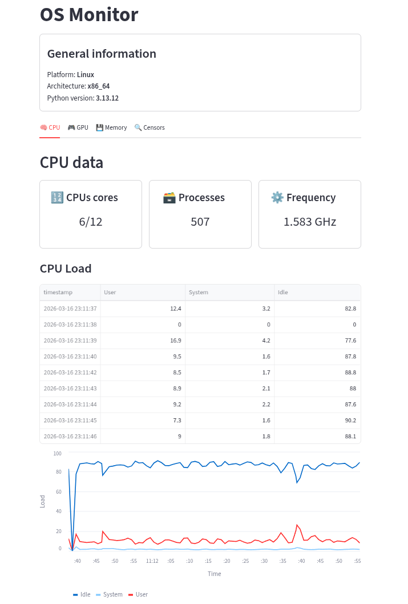
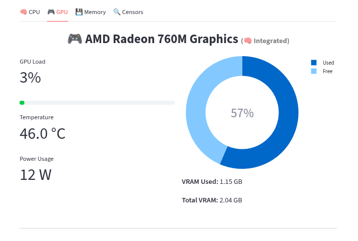
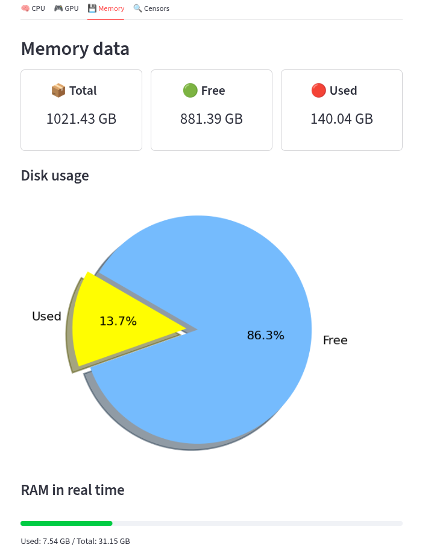
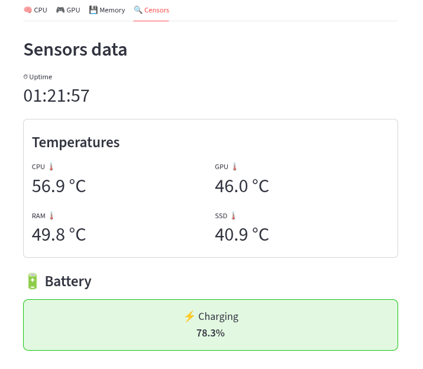

# OS Monitor

  <a href="#installation">Installation</a> •
  <a href="#overview">Overview</a> •
  <a href="#features">Features</a> •
  <a href="#tech-stack">Tech Stack</a> •
  <a href="#limitations">Limitations</a> •

<table>
<tr>
<td>
  A simple system monitoring dashboard built with Streamlit.

The application displays real-time system metrics including:
- `CPU usage` 
- `GPU statistics`
- `Memory consumption`
- `Storage information`
- `Hardware sensors`  

Metrics collection is implemented as reusable services shared between a Streamlit UI and a FastAPI API.

</td>
</tr>
</table>

## Installation

#### To set up and run this application, follow these steps:
1. Clone this repository to your local machine.
2. Install the required dependencies by running: `uv sync`.
3. Start the service using `streamlit run app.py`

## Overview

  <b>Main Dashboard + CPU</b>  
  

  <b>GPU Monitoring</b>  
  

  <b>Memory Usage</b>  
  

  <b>Hardware Sensors</b>  
  

## Features

- 📊 **Real-time system monitoring**
  - CPU usage
  - Memory usage
  - Storage statistics

- 🎮 **GPU monitoring**
  - AMD GPU usage
  - GPU memory information

- 🌡 **Hardware sensors**
  - Temperatures
  - Fan speeds
  - Other available system sensors

- 🖥 **Interactive dashboard**
  - Built with Streamlit
  - Clean UI for system metrics

- 🔌 **Metrics API**
  - FastAPI endpoint for retrieving real-time metrics

- 🧩 **Shared service architecture**
  - Metrics logic reused by both the Streamlit UI and FastAPI API

## Tech Stack

**Backend & UI**

- Python 
- Streamlit
- FastAPI

**System Monitoring**

- psutil – CPU, memory, storage metrics
- pyamdgpuinfo – AMD GPU metrics

**Environment**

- 📦 uv – Python package manager

## Limitations

| Component | Status |
|-----------|--------|
| Linux | ✅ Supported |
| Windows | ❌ Not supported |
| macOS | ❌ Not supported |
| AMD GPUs | ✅ Supported |
| NVIDIA GPUs | ❌ Not supported |